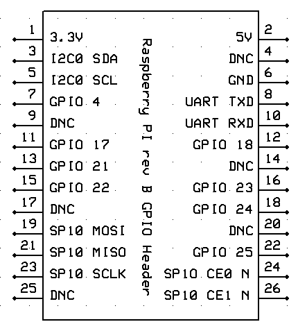
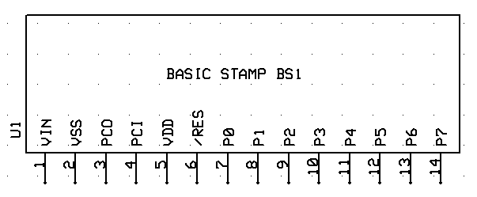
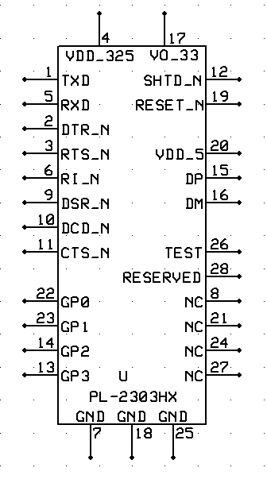

# ExpressSCH Component Library
Some components for the ExpressSCH CAD software.  Feel free to update and add to the library.

**Components:**

* Raspberry Pi rev B GPIO Header
* Parallax BASIC Stamp BS1
* Prolific PL-2303HX USB to Serial Emulation IC

## How to Use
Download or clone, open the .sch file you want, select a component, Component Menu > Save custom component...

## Visuals

